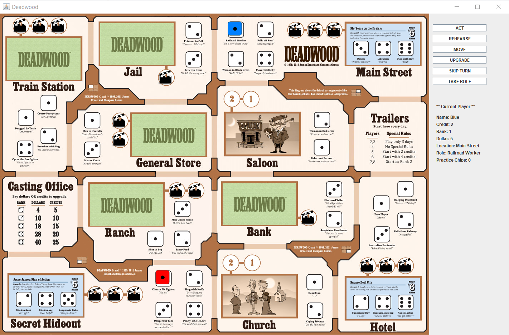
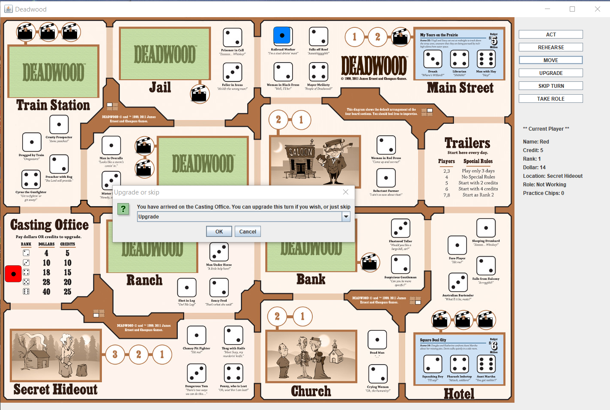

# Deadwood
Deadwood is the full implementation of real the 2D boardgame by Cheapass Games, LLC. Java swing library was used to implement graphic user interfaces. Object-oriented design and design patterns were applied for the efficient game system.

* The source code of this project is not available to open publicly since it was for the school course. Please contact me if you are interested in the code.

## Screenshots

